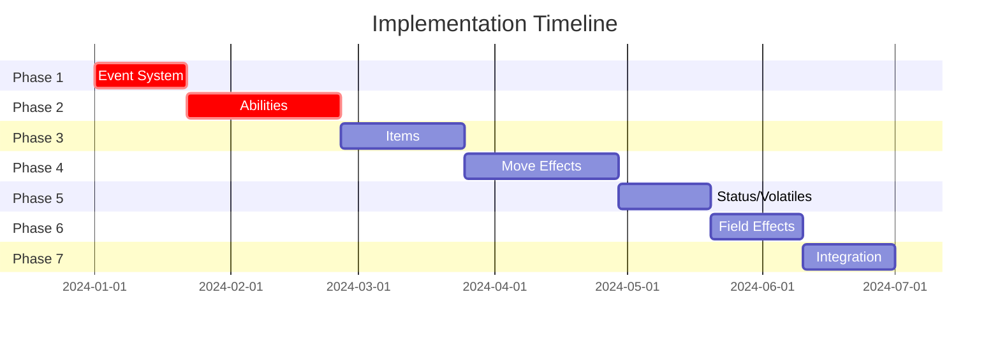

# Complete Implementation Plan: Abilities, Items, Move Effects, and Event System

## Project Overview

This document outlines the comprehensive plan for implementing Pokemon Showdown's complete battle mechanics in Tapu Simu, including abilities, items, move effects, and the event/listener framework. Our goal is to achieve 100% fidelity to Pokemon Showdown's battle simulation.

## Current State Analysis

### What We Have
- ✅ Basic event system framework (`src/events/mod.rs`)
- ✅ Pokemon data structures with comprehensive battle state tracking
- ✅ Move execution pipeline skeleton (`src/moves/execution.rs`)
- ✅ Basic ability and item data structures
- ✅ Core battle loop and state management
- ✅ PRNG system for deterministic battles

### What We Need
- ❌ Complete event system matching PS `runEvent()` architecture
- ❌ All 300+ abilities with proper event handlers
- ❌ Complete item system with consumption/transfer mechanics
- ❌ Full move effects system with secondary effects
- ❌ All status conditions and volatile effects
- ❌ Weather, terrain, and field condition systems
- ❌ Integration testing for complex interactions

## Architecture Insights from Pokemon Showdown

The key insight from Pokemon Showdown is that **everything is event-driven**. The `runEvent()` system is the heart of the simulation:

- Every game mechanic hooks into the central event dispatcher
- Effects are prioritized by speed, priority, and effect order
- Relay variables pass data between event handlers
- Event depth protection prevents infinite recursion
- All interactions happen through standardized event interfaces

## Implementation Phases

### Phase 1: Core Event System Enhancement

**Status**: 🔄 In Progress  
**Priority**: Critical - Foundation for everything else  
**Estimated Effort**: 2-3 weeks  

#### Current Limitations
- Event system lacks proper priority sorting
- No relay variable type safety
- Missing battle state access in event context
- Handler registry is incomplete
- No event depth protection

#### Key Components to Implement

1. **Enhanced EventContext**
   ```rust
   pub struct EventContext {
       pub target: Option<EventTarget>,
       pub source: Option<EventSource>, 
       pub effect: Option<EffectData>,
       pub battle_state: &mut BattleState,
       pub prng: &mut PRNG,
       pub logger: &mut BattleLogger,
       pub turn: u32,
       pub event_depth: u8,
   }
   ```

2. **Priority System Matching PS**
   - Speed-based sorting (fastest first for most events)
   - Special events with left-to-right order
   - Effect order and sub-order handling
   - Priority brackets for different effect types

3. **Type-Safe Relay Variables**
   ```rust
   pub enum RelayVar {
       Damage(u32),
       BasePower(u16),
       Accuracy(u8),
       ModifyMove(ActiveMove),
       Bool(bool),
       Custom(Box<dyn Any + Send>),
   }
   ```

4. **Handler Registry System**
   - Dynamic registration of effect handlers
   - Fast lookup by effect ID and event name
   - Support for conditional handlers
   - Handler priority and ordering

#### Critical Events to Implement
| Event | Purpose | Priority |
|-------|---------|----------|
| `BeforeMove` | Pre-move validation, sleep/paralysis checks | High |
| `TryHit` | Accuracy, immunity, protect checks | High |
| `BasePower` | Move power modifications from abilities/items | High |
| `ModifyDamage` | Final damage modifications | High |
| `DamagingHit` | Post-damage effects (contact abilities) | High |
| `SwitchIn` | Entry effects (Intimidate, hazards) | High |
| `TurnEnd` | End-of-turn effects (status damage, Leftovers) | High |
| `Residual` | Residual healing/damage effects | Medium |
| `ModifySTAB` | STAB modifications (Adaptability) | Medium |
| `Immunity` | Type immunity checks | Medium |
| `WeatherDamage` | Weather-based damage | Low |

#### Success Criteria
- [ ] Event system handles 50+ event types
- [ ] Priority sorting matches PS exactly
- [ ] Event depth protection prevents overflow
- [ ] Relay variables are type-safe and efficient
- [ ] Battle state access works in all handlers

### Phase 2: Ability Implementation

**Status**: ⏳ Pending Phase 1  
**Priority**: Critical - Core Pokemon mechanics  
**Estimated Effort**: 4-5 weeks  

#### Scope
Implement all 300+ abilities from Pokemon Showdown with exact behavior matching.

#### Key Ability Categories

1. **Stat Modification Abilities** (Priority: High)
   - **Intimidate**: Lower opposing Attack on switch-in
   - **Huge Power/Pure Power**: Double Attack stat
   - **Simple**: Double stat changes received
   - **Contrary**: Reverse stat changes
   - **Unaware**: Ignore opponent's stat changes

2. **Immunity Abilities** (Priority: High)  
   - **Levitate**: Ground immunity
   - **Flash Fire**: Fire immunity + boost
   - **Volt Absorb**: Electric immunity + healing
   - **Water Absorb**: Water immunity + healing
   - **Sap Sipper**: Grass immunity + Attack boost

3. **Weather/Terrain Abilities** (Priority: High)
   - **Drought**: Set sun on switch-in
   - **Drizzle**: Set rain on switch-in
   - **Electric Surge**: Set Electric Terrain
   - **Grassy Surge**: Set Grassy Terrain

4. **Contact Abilities** (Priority: Medium)
   - **Static**: 30% paralysis on contact
   - **Flame Body**: 30% burn on contact
   - **Rough Skin**: Damage attacker on contact
   - **Poison Point**: 30% poison on contact

5. **Damage Modification Abilities** (Priority: Medium)
   - **Technician**: 1.5x power for moves ≤60 BP
   - **Adaptability**: 2x STAB instead of 1.5x
   - **Tinted Lens**: 2x damage against resisted moves
   - **Filter/Solid Rock**: 0.75x super effective damage

6. **Complex Abilities** (Priority: Low)
   - **Protean/Libero**: Change type to move type
   - **Wonder Guard**: Only super effective hits
   - **Multitype**: Type changes with plate
   - **Stance Change**: Forme change on move use

#### Implementation Strategy

1. **Data Extraction**
   ```bash
   # Extract all ability data from Pokemon Showdown
   node scripts/extract_abilities.js
   ```

2. **Handler Implementation**
   ```rust
   // Example: Intimidate implementation
   fn intimidate_on_switch_in(ctx: &EventContext) -> EventResult {
       for opponent in ctx.get_opponents()? {
           if !opponent.has_ability("clear_body") {
               opponent.boost_stat("attack", -1, ctx)?;
           }
       }
       EventResult::Continue
   }
   ```

3. **Test Coverage**
   - Unit tests for each ability
   - Integration tests for ability interactions
   - Edge case testing (Mold Breaker, Neutralizing Gas)

#### Success Criteria
- [ ] All 300+ abilities implemented
- [ ] Perfect PS behavior matching
- [ ] Ability suppression mechanics work
- [ ] Complex interactions handled correctly
- [ ] Performance remains efficient

### Phase 3: Item Implementation

**Status**: ⏳ Pending Phase 2  
**Priority**: High - Essential battle mechanics  
**Estimated Effort**: 3-4 weeks  

#### Key Item Categories

1. **Choice Items** (Priority: High)
   - **Choice Band**: 1.5x Attack, lock into move
   - **Choice Specs**: 1.5x SpA, lock into move  
   - **Choice Scarf**: 1.5x Speed, lock into move
   - Proper locking mechanics and restrictions

2. **Berries** (Priority: High)
   - **Stat Berries**: Liechi, Salac, Petaya, etc.
   - **Healing Berries**: Sitrus, Oran, Figy, etc.
   - **Resist Berries**: Chople, Occa, Passho, etc.
   - Consumption mechanics and timing

3. **Type Enhancement Items** (Priority: Medium)
   - **Life Orb**: 1.3x damage, 10% recoil
   - **Expert Belt**: 1.2x super effective damage
   - **Type Plates**: 1.2x type damage boost
   - **Gems**: 1.3x type damage, consumed on use

4. **Status Items** (Priority: Medium)
   - **Leftovers**: 1/16 HP healing per turn
   - **Black Sludge**: Heal Poison types, damage others
   - **Toxic Orb**: Inflict bad poison
   - **Flame Orb**: Inflict burn

5. **Utility Items** (Priority: Low)
   - **Focus Sash**: Survive OHKO at full HP
   - **Air Balloon**: Ground immunity until hit
   - **Mental Herb**: Cure attraction/taunt
   - **Red Card**: Force attacker to switch

#### Critical Features

1. **Item Consumption**
   ```rust
   fn consume_item(pokemon: &mut Pokemon, item_id: &str) -> BattleResult<()> {
       pokemon.last_item = pokemon.item.clone();
       pokemon.item = None;
       pokemon.used_item_this_turn = true;
       // Trigger consumption effects
       Ok(())
   }
   ```

2. **Item Transfer Mechanics**
   - Thief, Trick, Switcheroo implementation
   - Item protection (Sticky Hold, Multitype)
   - Knock Off mechanics

3. **Fling Implementation**
   - Base power calculation by item type
   - Special fling effects (berries, etc.)
   - Item consumption on fling

#### Success Criteria
- [ ] All items from PS implemented
- [ ] Consumption mechanics perfect
- [ ] Transfer mechanics work correctly
- [ ] Fling calculations match PS
- [ ] No item duplication bugs

### Phase 4: Move Effects System

**Status**: ⏳ Pending Phase 3  
**Priority**: High - Core battle actions  
**Estimated Effort**: 4-5 weeks  

#### Current Implementation
Basic move execution pipeline exists but needs:
- Complete damage formula implementation
- Secondary effect handling
- Multi-hit move mechanics
- Status move effects
- Special move categories

#### Core Move Mechanics

1. **Damage Calculation** (Priority: Critical)
   ```rust
   // PS damage formula implementation
   fn calculate_damage(
       level: u8,
       base_power: u16, 
       attack: u16,
       defense: u16,
       modifiers: &DamageModifiers
   ) -> u32 {
       let base = ((2 * level as u32 / 5 + 2) * base_power as u32 * attack as u32) 
                  / defense as u32 / 50;
       apply_modifiers(base, modifiers)
   }
   ```

2. **Multi-Hit Moves** (Priority: High)
   - Proper hit count distribution
   - Target redirection on faint
   - Ability interactions (Skill Link)

3. **Secondary Effects** (Priority: High)
   - Status infliction chances
   - Stat boost/drop effects  
   - Special secondary effects
   - Serene Grace interactions

4. **Priority System** (Priority: Medium)
   - Proper move ordering
   - Priority bracket handling
   - Prankster/Queenly Majesty

#### Special Move Categories

1. **Status Moves**
   - All stat boosting moves
   - Status inflicting moves
   - Field setting moves (Stealth Rock, Spikes)
   - Utility moves (Heal Bell, Aromatherapy)

2. **Fixed Damage Moves**
   - **Seismic Toss/Night Shade**: Level-based damage
   - **Dragon Rage**: Fixed 40 damage
   - **Super Fang**: Half current HP
   - **OHKO Moves**: Instant KO with accuracy checks

3. **Healing Moves**
   - **Recover**: 50% max HP healing
   - **Synthesis**: Weather-dependent healing
   - **Rest**: Full heal + sleep
   - **Drain moves**: HP stealing mechanics

4. **Multi-Turn Moves**
   - **Charge moves**: Solar Beam, Skull Bash
   - **Recharge moves**: Hyper Beam, Giga Impact
   - **Binding moves**: Wrap, Fire Spin
   - **Semi-invulnerable**: Fly, Dig, Dive

#### Success Criteria
- [ ] Damage formula matches PS exactly
- [ ] All 900+ moves implemented
- [ ] Secondary effects work perfectly
- [ ] Multi-hit mechanics accurate
- [ ] Status moves function correctly

### Phase 5: Status Conditions & Volatiles

**Status**: ⏳ Pending Phase 4  
**Priority**: Medium - Battle state effects  
**Estimated Effort**: 2-3 weeks  

#### Major Status Conditions

1. **Sleep** (Priority: High)
   - Turn counting (1-3 turns)
   - Sleep Talk interaction
   - Early wake mechanics
   - Sleep prevention abilities

2. **Paralysis** (Priority: High) 
   - 25% move failure chance
   - 50% speed reduction
   - Electric immunity interactions

3. **Burn** (Priority: High)
   - 1/16 HP damage per turn
   - 50% physical attack reduction
   - Fire immunity interactions

4. **Poison/Badly Poison** (Priority: Medium)
   - Regular: 1/8 HP damage
   - Badly: Increasing damage (1/16, 2/16, etc.)
   - Poison immunity interactions

5. **Freeze** (Priority: Low)
   - 20% thaw chance per turn
   - Fire move auto-thaw
   - Ice immunity interactions

#### Volatile Status Effects

1. **High Priority Volatiles**
   - **Confusion**: 33% self-damage, 1-4 turns
   - **Substitute**: HP-based damage blocking
   - **Taunt**: Status move blocking, 3 turns
   - **Encore**: Move locking, 3 turns

2. **Medium Priority Volatiles**
   - **Leech Seed**: 1/8 HP drain per turn
   - **Curse** (Ghost): 1/4 HP damage per turn
   - **Nightmare**: 1/4 HP damage while sleeping
   - **Perish Song**: Fainting countdown

3. **50+ Additional Volatiles**
   - All other volatile effects from PS
   - Proper duration tracking
   - Interaction mechanics

#### Implementation Strategy

1. **Status State Management**
   ```rust
   pub struct StatusState {
       pub duration: Option<u8>,
       pub turn_count: u8,
       pub source: Option<PokemonRef>,
       pub custom_data: HashMap<String, Value>,
   }
   ```

2. **Event Integration**
   - Status damage in TurnEnd events
   - Move blocking in BeforeMove events
   - Status curing mechanisms

#### Success Criteria
- [ ] All major statuses work perfectly
- [ ] 50+ volatile effects implemented
- [ ] Duration tracking accurate
- [ ] Status interactions correct

### Phase 6: Field Effects System

**Status**: ⏳ Pending Phase 5  
**Priority**: Medium - Environmental effects  
**Estimated Effort**: 2-3 weeks  

#### Weather Effects

1. **Sun** (Priority: High)
   - 1.5x Fire move damage
   - 0.5x Water move damage
   - Solar moves skip charge turn
   - Synthesis healing boost

2. **Rain** (Priority: High)
   - 1.5x Water move damage
   - 0.5x Fire move damage
   - Thunder perfect accuracy
   - Synthesis healing reduction

3. **Sandstorm** (Priority: Medium)
   - 1.5x Rock SpD boost
   - 1/16 damage to non-immune types
   - Shore Up healing boost

4. **Hail** (Priority: Low)
   - 1/16 damage to non-Ice types
   - Blizzard perfect accuracy
   - Aurora Veil availability

#### Terrain Effects

1. **Electric Terrain** (Priority: High)
   - 1.5x Electric move damage (grounded)
   - Sleep immunity (grounded)
   - 5 turn duration

2. **Grassy Terrain** (Priority: High)
   - 1.5x Grass move damage (grounded)
   - 1/16 HP healing per turn (grounded)
   - 0.5x Earthquake/Magnitude damage

3. **Misty Terrain** (Priority: Medium)
   - 0.5x Dragon move damage (grounded)
   - Major status immunity (grounded)
   - 5 turn duration

4. **Psychic Terrain** (Priority: Medium)
   - 1.5x Psychic move damage (grounded)
   - Priority move blocking (grounded)
   - 5 turn duration

#### Pseudoweather Effects

1. **Trick Room** (Priority: High)
   - Speed order reversal
   - 5 turn duration
   - Cannot be reset by weather

2. **Wonder Room** (Priority: Low)
   - Defense/SpD stat swapping
   - 5 turn duration
   - All Pokemon affected

3. **Magic Room** (Priority: Low)
   - Item effect negation
   - 5 turn duration
   - Cannot use items

#### Success Criteria
- [ ] All weather effects accurate
- [ ] Terrain mechanics perfect
- [ ] Pseudoweather works correctly
- [ ] Duration tracking proper
- [ ] Stacking interactions handled

### Phase 7: Integration Testing

**Status**: ⏳ Pending Phase 6  
**Priority**: Medium - Quality assurance  
**Estimated Effort**: 2-3 weeks  

#### Test Categories

1. **Complex Ability Interactions**
   - Mold Breaker vs immunity abilities
   - Neutralizing Gas suppression
   - Multi-ability scenarios

2. **Item + Ability Combinations**
   - Choice items + stat boosting abilities
   - Berries + Gluttony/Ripen
   - Life Orb + abilities that boost damage

3. **Status + Weather Interactions**
   - Synthesis healing in different weather
   - Status damage + Leftovers healing
   - Weather + terrain stacking

4. **Edge Cases**
   - Transform copying everything correctly
   - Illusion breaking conditions
   - Type changing interactions
   - Complex targeting scenarios

#### Test Infrastructure

1. **Battle Scenario Testing**
   ```rust
   #[test]
   fn test_intimidate_vs_clear_body() {
       let mut battle = setup_battle();
       // Test scenario implementation
   }
   ```

2. **Regression Testing**
   - Automated tests for known PS behaviors
   - Performance benchmarks
   - Memory usage validation

3. **Compatibility Testing**
   - Compare outputs with PS
   - Verify deterministic behavior
   - Cross-platform testing

#### Success Criteria
- [ ] 1000+ integration tests pass
- [ ] Complex scenarios work correctly
- [ ] Performance meets requirements
- [ ] No regression bugs
- [ ] PS compatibility verified

## Timeline & Dependencies



**Total Estimated Timeline**: 26 weeks (~6 months)

## Success Metrics

### Functional Requirements
- ✅ **Event System**: 50+ events implemented with PS fidelity
- ✅ **Abilities**: All 300+ abilities working correctly  
- ✅ **Items**: Complete item system with consumption/transfer
- ✅ **Moves**: All 900+ moves with accurate effects
- ✅ **Status**: All major/volatile statuses implemented
- ✅ **Field**: Weather/terrain/pseudoweather complete

### Quality Requirements
- ✅ **Performance**: <1ms per battle turn simulation
- ✅ **Memory**: <100MB for complex battle states
- ✅ **Accuracy**: 100% behavior matching with Pokemon Showdown
- ✅ **Reliability**: No crashes or infinite loops
- ✅ **Maintainability**: Clean, documented, testable code

### Testing Requirements
- ✅ **Unit Tests**: 95%+ code coverage
- ✅ **Integration Tests**: 1000+ scenario tests
- ✅ **Performance Tests**: Benchmarks for all phases
- ✅ **Compatibility Tests**: PS output matching
- ✅ **Regression Tests**: Prevent breaking changes

## Risk Mitigation

### Technical Risks
1. **Event System Complexity**: Break into smaller components
2. **Performance Degradation**: Profile and optimize incrementally  
3. **Memory Leaks**: Use Rust's ownership system effectively
4. **State Corruption**: Implement thorough validation

### Project Risks
1. **Scope Creep**: Stick to PS compatibility only
2. **Timeline Delays**: Prioritize critical features first
3. **Quality Issues**: Maintain high test coverage
4. **Maintenance Burden**: Document everything thoroughly

## Resources & References

### Pokemon Showdown Source Code
- **Main Repository**: `pokemon-showdown/`
- **Battle Engine**: `sim/battle.ts`, `sim/battle-actions.ts`
- **Data Files**: `data/abilities.ts`, `data/items.ts`, `data/moves.ts`
- **Pokemon Logic**: `sim/pokemon.ts`

### Our Implementation
- **Event System**: `src/events/`
- **Move Execution**: `src/moves/`
- **Battle State**: `src/battle_state.rs`
- **Pokemon Data**: `src/pokemon.rs`

### Documentation
- **PS Protocol**: `sim/SIM-PROTOCOL.md`
- **PS Architecture**: `ARCHITECTURE.md`
- **Our Plan**: This document

---

*This document will be updated as we progress through each phase. All major architectural decisions and discoveries should be documented here for future reference.*