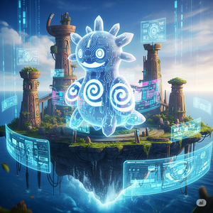

# Tapu Simu

<div align="center">
  
</div>

**A next-generation Pokemon battle simulator built from the ground up for multi-format support.**

Tapu Simu is a comprehensive battle engine featuring format-aware mechanics, position-based targeting, and Pokemon Showdown data integration. Designed for accuracy, performance, and extensibility across all Pokemon battle formats.

[](https://www.rust-lang.org)
[](LICENSE)

⚠️ **Note**: This project is under active development and not yet ready for production use.

## ✨ Key Features

- **🎯 Multi-Format Support**: Native Singles, Doubles, and VGC format support
- **📍 Position-Based Targeting**: Explicit position targeting for all moves and effects
- **🔄 Format-Aware Architecture**: Battle logic automatically adapts to the active format
- **📊 Comprehensive Instruction System**: 40+ instruction types covering all battle mechanics
- **↩️ Full Undo Support**: Complete battle state reversibility for AI and analysis
- **⚡ Pokemon Showdown Integration**: Direct data integration with PS format
- **🧪 Extensive Testing**: Comprehensive test suite with dedicated testing framework
- **🌐 Web Interface**: Built-in UI server for battle visualization and interaction

## 🏗️ Architecture

Tapu Simu follows a clean, modular architecture designed for maintainability and extensibility:

```
src/
├── core/           # Core battle abstractions
│   ├── battle_format.rs    # Format definitions and mechanics
│   ├── instruction.rs      # Battle instruction system
│   ├── move_choice.rs      # Move selection and targeting
│   └── state.rs           # Battle state management
├── engine/         # Battle mechanics implementation
│   ├── combat/            # Damage calculation and type effectiveness
│   ├── mechanics/         # Abilities, items, and switch effects
│   ├── targeting/         # Auto-targeting and format-specific targeting
│   └── turn/              # Turn processing and instruction generation
├── data/           # Pokemon data integration
│   ├── services/          # Type charts and move services
│   ├── loader.rs          # Data loading from PS JSON files
│   └── ps_types.rs        # Pokemon Showdown type definitions
├── testing/        # Testing framework and utilities
├── ui/             # Web interface bridge
└── bin/            # Binary executables
```

## 🚀 Quick Start

### Installation

```bash
# Clone the repository
git clone <repository-url>
cd tapu-simu

# Build the project
cargo build --release

# Run tests
cargo test

# Run the CLI
cargo run -- --help
```

### Basic Usage

#### Battle CLI

Tapu Simu includes a comprehensive command-line interface for running Pokemon battles with AI players:

```bash
# Run a single battle between two random players
cargo run --bin tapu-simu -- battle

# Run multiple battles with different player types
cargo run --bin tapu-simu -- battle \
  --format doubles \
  --player-one random \
  --player-two damage \
  --runs 100

# Run battles with verbose logging
cargo run --bin tapu-simu -- battle \
  --format singles \
  --player-one first \
  --player-two random \
  --max-turns 50 \
  --verbose

# Test different battle formats
cargo run --bin tapu-simu -- battle --format vgc --runs 10
cargo run --bin tapu-simu -- battle --format gen4ou --runs 5
```

**Available Player Types:**
- `random` - Selects moves randomly from available options
- `first` - Always chooses the first available move
- `damage` - Estimates damage and picks highest-damage moves

**Supported Formats:**
- `singles` - Standard 1v1 singles battles
- `doubles` - 2v2 doubles battles  
- `vgc` - VGC 2024 format with official rules
- `triples` - 3v3 triples battles
- `gen9ou` - Generation 9 OU singles
- `gen4ou` - Generation 4 OU singles

**Battle Statistics:**
When running multiple battles, the CLI provides detailed statistics:

```bash
$ cargo run --bin tapu-simu -- battle --runs 50 --player-one random --player-two damage

Running 50 battle(s) in Singles format

=== Battle Summary ===
Total battles: 50
Player 1 (random) wins: 18 (36.0%)
Player 2 (damage) wins: 32 (64.0%)
Draws: 0 (0.0%)
```

#### Utility Commands

```bash
# Validate battle format configuration
cargo run --bin tapu-simu -- validate-format doubles

# Show engine information and supported features
cargo run --bin tapu-simu -- info
```

#### Web Interface

```bash
# Start the UI server
cargo run --bin ui-server

# Open browser to http://localhost:3000
# Build and serve the frontend (requires Node.js)
cd ui && npm install && npm run dev
```

#### Library Usage

```rust
use tapu_simu::{BattleFormat, State, MoveChoice};
use tapu_simu::core::move_choice::{MoveIndex, PokemonIndex};
use tapu_simu::core::battle_format::{BattlePosition, SideReference};
use tapu_simu::engine::turn::instruction_generator::InstructionGenerator;

// Create a new doubles battle
let mut state = State::new(BattleFormat::gen9_vgc());

// Create move choices with explicit targeting
let move1 = MoveChoice::new_move(
    MoveIndex::M0, 
    vec![BattlePosition::new(SideReference::SideTwo, 0)]
);
let move2 = MoveChoice::new_move(
    MoveIndex::M0, 
    vec![BattlePosition::new(SideReference::SideOne, 0)]
);

// Generate and apply instructions
let generator = InstructionGenerator::new(BattleFormat::gen9_vgc());
let instructions = generator.generate_instructions(&mut state, &move1, &move2);

for instruction_set in instructions {
    state.apply_instructions(&instruction_set.instruction);
    // Process battle state...
    state.reverse_instructions(&instruction_set.instruction); // Undo if needed
}
```

## 🧪 Testing

The engine includes comprehensive testing with a dedicated framework:

```bash
# Run all tests
cargo test

# Run tests for a specific module
cargo test battle_format

# Run tests with output
cargo test -- --nocapture

# Run integration tests
cargo test --test test_core_battle_mechanics
cargo test --test test_instruction_generation_integration
```

### Test Categories

- **Unit Tests**: Core component testing
- **Integration Tests**: Cross-module functionality
- **Battle Mechanics Tests**: Game-accurate battle scenarios
- **Instruction System Tests**: Instruction generation and application
- **End-of-Turn Tests**: Complex turn resolution scenarios

## ⚙️ Configuration

### Features

Tapu Simu supports generation-specific features and optimizations:

```toml
[features]
# Generation support
gen1 = []
gen2 = []
gen3 = []
gen4 = []
gen5 = []
gen6 = []
gen7 = []
gen8 = []
gen9 = []

# Generation-specific mechanics
terastallization = ["gen9"]

# Performance optimizations
remove_low_chance_instructions = []

# Default features (Gen 9 with Terastallization)
default = ["gen9", "terastallization"]
```

### Custom Builds

```bash
# Build for specific generation
cargo build --no-default-features --features gen4

# Build with optimizations
cargo build --features remove_low_chance_instructions

# Build for competitive formats
cargo build --features gen9,terastallization
```

## 📊 Battle Mechanics

### Position-Based Targeting System

All moves use explicit position targeting instead of implicit "opponent" targeting:

```rust
// Singles targeting
let target = BattlePosition::new(SideReference::SideTwo, 0);

// Doubles targeting - hit both opponents
let targets = vec![
    BattlePosition::new(SideReference::SideTwo, 0),
    BattlePosition::new(SideReference::SideTwo, 1),
];

let move_choice = MoveChoice::new_move(MoveIndex::M0, targets);
```

### Instruction System

Battle mechanics are implemented through atomic, reversible instructions:

```rust
// Damage instruction with undo support
let instruction = Instruction::PositionDamage(PositionDamageInstruction {
    target_position: BattlePosition::new(SideReference::SideTwo, 0),
    damage_amount: 50,
    previous_hp: Some(100), // For undo support
});

// Probabilistic instruction sets
let instructions = StateInstructions::new(95.0, vec![normal_damage]);
let crit_instructions = StateInstructions::new(5.0, vec![critical_damage]);
```

### Format-Aware Mechanics

The engine automatically handles format-specific behavior:

- **Singles**: Direct targeting, no redirection
- **Doubles**: Spread move damage reduction, redirection abilities, position-aware targeting
- **VGC**: Team preview, restricted legendaries, format-specific clauses

## 🗂️ Data Integration

### Pokemon Showdown Data

Tapu Simu integrates directly with Pokemon Showdown's data format:

```
data/ps-extracted/
├── moves.json              # Complete move database
├── moves-by-generation.json # Generation-specific move data
├── items.json              # Item database
├── pokemon.json            # Pokemon species data
└── move-changes.json       # Generation-specific changes
```

### Data Extraction

```bash
# Extract latest PS data (requires Node.js)
cd tools/ps-data-extractor
npm install
npm run extract
```

## 🎮 Battle Formats

Currently supported formats:

- **Singles**: Standard 1v1 battles
- **Doubles**: 2v2 battles with format-specific mechanics
- **VGC**: Official Video Game Championship format
- **Custom**: Extensible format system for custom rulesets

## 🔄 Development Status

### Implemented Systems ✅

- Core battle state management
- Position-based targeting system
- Instruction generation and application
- Multi-format architecture
- Pokemon Showdown data integration
- Comprehensive undo system
- **Complete battle environment and game loop**
- **AI player system (Random, FirstMove, DamageMaximizer)**
- **Full CLI battle interface with statistics**
- **Parallel battle execution**
- Web UI interface
- Testing framework

### In Progress 🟡

- Move effect implementations (~38% complete)
- Advanced battle mechanics (items, abilities)
- Generation-specific mechanics
- AI player implementations

### Planned Features 📋

- Team builder integration
- Battle replays and analysis
- Advanced AI algorithms
- Tournament management system
- Plugin system for custom mechanics

## 🤝 Contributing

Tapu Simu follows strict development principles:

1. **Format-First Design**: All features must support multiple formats
2. **Position-Based Targeting**: No implicit targeting assumptions
3. **KISS Principle**: Keep implementations simple and maintainable
4. **Test-Driven Development**: All features require comprehensive tests

See `CLAUDE.md` for detailed development guidelines.

## 📁 Project Structure

```
tapu-simu/
├── src/                    # Source code
├── tests/                  # Integration tests
├── data/                   # Pokemon data files
├── docs/                   # Documentation
├── ui/                     # Web interface (React/TypeScript)
├── tools/                  # Development tools
└── examples/               # Usage examples
```

## 📋 Dependencies

### Core Dependencies

- **clap**: Command-line interface
- **serde**: Data serialization
- **tokio**: Async runtime for web server
- **axum**: Web framework for UI server
- **rayon**: Parallel processing

### Development Dependencies

- **colored**: Terminal output formatting
- **uuid**: Unique identifiers for battle states

## 📝 License

This project is licensed under the MIT License - see the [LICENSE](LICENSE) file for details.

## 🙏 Acknowledgments

- **Pokemon Showdown**: Data format and battle mechanics reference
- **Original poke-engine**: Foundation and inspiration for battle mechanics
- **Rust Community**: Excellent tooling and ecosystem support

---

**Note**: Tapu Simu is an independent project and is not affiliated with The Pokemon Company, Game Freak, or Pokemon Showdown.