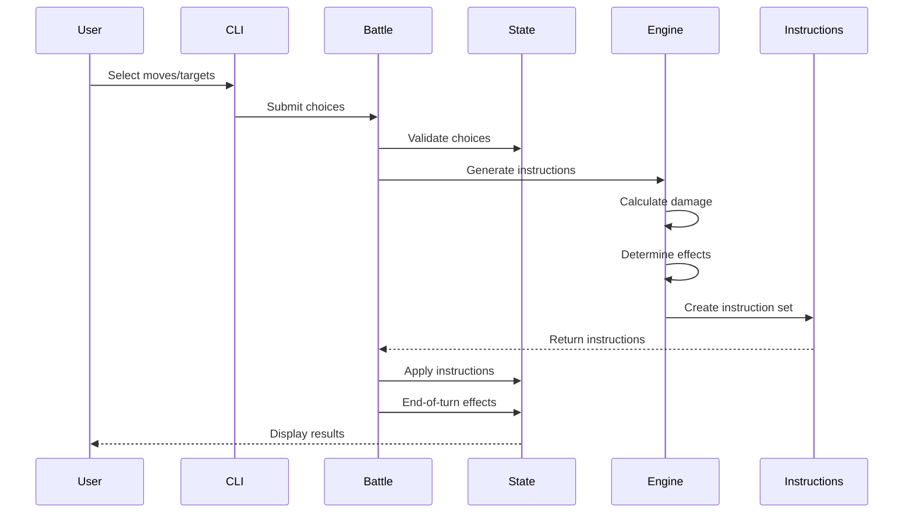

# Tapu Simu - High-Level Design

## Executive Summary

Tapu Simu is a standalone, format-aware Pokemon battle simulator built from first principles to support multiple battle formats (Singles, Doubles, VGC, Triples). Unlike traditional Pokemon simulators that retrofit multi-format support, Tapu Simu is designed with position-based mechanics as its foundation.

## Design Philosophy

### Core Tenets

1. **Format-First Architecture**: Every component assumes multiple active Pokemon per side
2. **Position-Based Everything**: All targeting, effects, and mechanics use explicit positions
3. **Standalone Implementation**: No dependencies on V1 engine, complete autonomy
4. **Clean State Management**: Immutable state during calculations, explicit mutations
5. **Instruction-Based Updates**: All state changes go through atomic instructions

### Key Differentiators from V1

| Aspect | V1 Approach | V2 Approach |
|--------|-------------|-------------|
| Targeting | Implicit "opponent" | Explicit BattlePosition |
| Format Support | Singles-first, Doubles added | Multi-format native |
| State Updates | Direct mutation | Instruction-based |
| Move Choices | Simple enum | Position-aware choices |
| Backwards Compatibility | Required | Not considered |

## System Architecture

### Component Overview

```
┌─────────────────────────────────────────────────────────────┐
│                        CLI Interface                         │
│                         (io.rs)                             │
└─────────────────────┬───────────────────────────────────────┘
                      │
┌─────────────────────▼───────────────────────────────────────┐
│                    Battle Controller                         │
│              (Orchestrates battle flow)                      │
└─────────────────────┬───────────────────────────────────────┘
                      │
        ┌─────────────┴─────────────┬─────────────────────┐
        │                           │                       │
┌───────▼────────┐         ┌───────▼────────┐     ┌───────▼────────┐
│ Format System  │         │ State System   │     │ Instruction    │
│                │         │                │     │ System         │
│ - BattleFormat │         │ - State        │     │ - Instructions │
│ - BattlePosition        │ - BattleSide   │     │ - Generator    │
│ - Targeting    │         │ - Pokemon      │     │ - Processor    │
└────────────────┘         └────────────────┘     └────────────────┘
        │                           │                       │
        └───────────────────────────┴───────────────────────┘
                                │
                      ┌─────────▼─────────┐
                      │   Data Layer      │
                      │                   │
                      │ - Rustemon Client │
                      │ - Type System     │
                      │ - Move Data       │
                      └───────────────────┘
```

### Core Components

#### 1. Battle Format System (`battle_format.rs`)

**Purpose**: Define battle formats and position management

**Key Types**:
```rust
pub enum BattleFormat {
    Singles,  // 1v1
    Doubles,  // 2v2
    Vgc,      // 2v2 with VGC rules
    Triples,  // 3v3
}

pub struct BattlePosition {
    pub side: SideReference,
    pub slot: usize,
}
```

**Responsibilities**:
- Active Pokemon count per format
- Position validation
- Spread move mechanics
- Ally/opponent position resolution

#### 2. State Management (`state.rs`)

**Purpose**: Represent complete battle state

**Key Structure**:
```rust
pub struct State {
    pub format: BattleFormat,
    pub side_one: BattleSide,
    pub side_two: BattleSide,
    pub weather: Weather,
    pub terrain: Terrain,
    pub turn: u32,
}
```

**Design Principles**:
- Immutable during calculations
- Position-based Pokemon access
- Format-aware initialization
- Clear ownership of data

#### 3. Instruction System (`instruction.rs`)

**Purpose**: Atomic state modifications with position tracking

**Key Types**:
```rust
pub enum Instruction {
    PositionDamage(PositionDamageInstruction),
    PositionHeal(PositionHealInstruction),
    MultiTargetDamage(MultiTargetDamageInstruction),
    ApplyStatus(ApplyStatusInstruction),
    // ... more instruction types
}

pub struct StateInstructions {
    pub percentage: f32,
    pub instruction_list: Vec<Instruction>,
    pub affected_positions: Vec<BattlePosition>,
}
```

**Benefits**:
- Traceable state changes
- Replayable battles
- Clean testing
- Network synchronization ready

#### 4. Move Choice System (`move_choice.rs`)

**Purpose**: Express player decisions with explicit targeting

**Key Design**:
```rust
pub enum MoveChoice {
    Move {
        move_index: MoveIndex,
        target_positions: Vec<BattlePosition>,
    },
    Switch(PokemonIndex),
    None,
}
```

**Features**:
- Explicit target declaration
- Multi-target support
- Format-agnostic choices
- Validation ready

#### 5. Generation Engine (`genx/`)

**Purpose**: Implement battle mechanics for specific generations

**Components**:
- `instruction_generator.rs`: Convert choices to instructions
- `damage_calc.rs`: Damage formula implementation
- `move_effects.rs`: Special move effects

**Design Pattern**:
```rust
pub trait GenerationEngine {
    fn generate_instructions(
        &self,
        state: &State,
        p1_choice: &MoveChoice,
        p2_choice: &MoveChoice,
    ) -> Vec<StateInstructions>;
}
```

## Battle Flow

### Turn Sequence



### Instruction Generation Pipeline

1. **Input Validation**
   - Verify move choices are legal
   - Validate target positions
   - Check Pokemon can act

2. **Priority Resolution**
   - Sort actions by priority
   - Handle speed ties
   - Apply ability/item modifiers

3. **Effect Calculation**
   - Calculate base damage
   - Apply type effectiveness
   - Check for critical hits
   - Apply damage modifiers

4. **Instruction Creation**
   - Create atomic instructions
   - Track affected positions
   - Handle branching (miss/hit)

5. **State Application**
   - Apply instructions sequentially
   - Update Pokemon HP/status
   - Trigger reactive abilities

## Key Algorithms

### Damage Calculation

```rust
damage = ((((2 * level / 5 + 2) * power * attack / defense) / 50) + 2) 
         * modifiers * roll * spread_penalty
```

Where:
- `spread_penalty` = 0.75 for moves hitting multiple targets
- `modifiers` include STAB, weather, abilities, items
- `roll` is random between 0.85-1.0

### Target Resolution

For moves with `MoveTarget::AllOtherPokemon`:
- Singles: [opponent]
- Doubles: [opponent_slot_0, opponent_slot_1, ally]
- Triples: [all 5 other Pokemon]

### Position Validation

```rust
fn is_valid_target(format: &BattleFormat, user: BattlePosition, target: BattlePosition) -> bool {
    target.slot < format.active_pokemon_count() 
    && state.is_position_active(target)
    && can_reach(user, target, format)
}
```

## Data Architecture

### Pokemon Data Flow

```
PokeAPI → Rustemon → EnginePokemonData → Pokemon (in State)
```

### Move Data Structure

```rust
pub struct EngineMoveData {
    pub id: i32,
    pub name: String,
    pub base_power: Option<i16>,
    pub accuracy: Option<i16>,
    pub pp: i16,
    pub move_type: String,
    pub category: MoveCategory,
    pub priority: i8,
    pub target: MoveTarget,
    pub effect_chance: Option<i16>,
    pub flags: Vec<String>,
}
```

### Type System

- Runtime type effectiveness lookup
- Format-aware immunities (e.g., Ground immunity in no-grounded formats)
- Dynamic type changes (Protean, Terastallization)

## Extensibility

### Adding New Formats

1. Add variant to `BattleFormat` enum
2. Define active Pokemon count
3. Implement format-specific rules
4. Add targeting validation

### Adding New Generations

1. Create new module under `src/gen{X}/`
2. Implement generation-specific mechanics
3. Wire up feature flag
4. Add generation tests

### Adding New Move Effects

1. Define effect in `move_effects.rs`
2. Create instruction types if needed
3. Implement effect logic
4. Add position-aware tests

## Performance Considerations

### Optimization Strategies

1. **Instruction Batching**: Group related instructions
2. **Lazy Evaluation**: Calculate only when needed
3. **Position Caching**: Cache active position lookups
4. **Parallel Damage Calc**: Calculate independent damages concurrently

### Memory Layout

- Compact position representation (u8 for side/slot)
- Instruction pooling for common operations
- State snapshots for rollback

## Testing Strategy

### Test Categories

1. **Unit Tests**: Individual component behavior
2. **Integration Tests**: Multi-component interactions
3. **Format Tests**: Format-specific mechanics
4. **Regression Tests**: Known edge cases
5. **Property Tests**: Invariant validation

### Test Principles

- Every mechanic tested in all formats
- Position targeting validation
- Instruction output verification
- State consistency checks

## Future Enhancements

### Phase 1: Core Completion
- [ ] Full move effect library
- [ ] Complete status system
- [ ] Weather/terrain effects
- [ ] Ability framework

### Phase 2: Advanced Features
- [ ] Team validation
- [ ] Clause enforcement
- [ ] Battle replay system
- [ ] AI framework

### Phase 3: Ecosystem
- [ ] REST API
- [ ] WebSocket support
- [ ] Python bindings
- [ ] WASM compilation

## Conclusion

Tapu Simu represents a ground-up reimagining of Pokemon battle mechanics with multi-format support as a first-class concern. By using position-based mechanics and instruction-driven state management, Tapu Simu provides a robust foundation for implementing the full complexity of Pokemon battles across all formats.