# Tapu Simu Architecture Reference

*The definitive guide to understanding Tapu Simu's architecture, data flows, and battle execution system*

## Table of Contents

1. [System Overview](#system-overview)
2. [Architecture Diagrams](#architecture-diagrams)
3. [Data Flow Patterns](#data-flow-patterns)
4. [Battle Execution Flow](#battle-execution-flow)
5. [Module Integration](#module-integration)
6. [State Management](#state-management)
7. [Critical Path Analysis](#critical-path-analysis)

---

## System Overview

Tapu Simu is a sophisticated Pokemon battle simulator architected from the ground up with modern Rust principles. The system follows a **format-first, position-based targeting design** that supports multiple battle formats while maintaining clean separation between data, business logic, and presentation layers.

### Core Principles

- **Format-First Design**: Every component assumes multi-format support from inception
- **Position-Based Targeting**: Explicit positioning system eliminates format assumptions
- **Immutable State**: Battle state is read-only with transformation-based updates
- **Type Safety**: Extensive use of Rust's type system for correctness guarantees
- **Generation-Aware**: Proper handling of Pokemon mechanics across all generations

---

## Architecture Diagrams

### 1. High-Level System Architecture

```mermaid
graph TB
    subgraph "User Interface Layer"
        UI[User Interface]
        CLI[Command Line Interface]
        API[REST API]
    end

    subgraph "Application Layer"
        BattleBuilder[Battle Builder]
        TeamBuilder[Team Builder]
        FormatBuilder[Format Builder]
        BattleEnvironment[Battle Environment]
    end

    subgraph "Domain Layer"
        BattleState[Battle State]
        BattleEngine[Battle Engine]
        Instructions[Instruction System]
        Players[Player System]
    end

    subgraph "Infrastructure Layer"
        DataRepos[Data Repositories]
        TypeSystem[Type System]
        GenerationSystem[Generation System]
        ErrorHandling[Error Handling]
    end

    subgraph "Data Layer"
        JSONData[Pokemon Showdown JSON]
        RepositoryCache[Repository Cache]
        GenerationData[Generation-Specific Data]
    end

    UI --> BattleBuilder
    CLI --> BattleBuilder
    API --> BattleBuilder
    
    BattleBuilder --> TeamBuilder
    BattleBuilder --> FormatBuilder
    BattleBuilder --> BattleEnvironment
    
    BattleEnvironment --> BattleState
    BattleEnvironment --> BattleEngine
    BattleEnvironment --> Players
    
    BattleEngine --> Instructions
    BattleEngine --> DataRepos
    
    BattleState --> TypeSystem
    Instructions --> TypeSystem
    
    DataRepos --> RepositoryCache
    DataRepos --> GenerationSystem
    
    RepositoryCache --> JSONData
    GenerationSystem --> GenerationData
    
    TypeSystem --> ErrorHandling
    DataRepos --> ErrorHandling
```



### 2. Data Repository Architecture


### 3. Battle Execution Flow

```mermaid
sequenceDiagram
    participant Player1
    participant Player2
    participant BattleEnvironment
    participant BattleEngine
    participant BattleState
    participant InstructionSystem
    participant DataRepositories

    Note over Player1,DataRepositories: Battle Initialization
    BattleEnvironment->>BattleState: new(format, teams)
    BattleState->>DataRepositories: validate_teams()
    DataRepositories-->>BattleState: validation_result

    loop Turn Loop
        Note over Player1,DataRepositories: Move Selection Phase
        BattleEnvironment->>Player1: choose_move(state, options)
        Player1-->>BattleEnvironment: MoveChoice
        BattleEnvironment->>Player2: choose_move(state, options)
        Player2-->>BattleEnvironment: MoveChoice

        Note over Player1,DataRepositories: Turn Execution Phase
        BattleEnvironment->>BattleEngine: execute_turn(choices)
        BattleEngine->>BattleEngine: resolve_targeting()
        BattleEngine->>BattleEngine: determine_move_order()
        
        loop For Each Move
            BattleEngine->>BattleEngine: check_move_prevention()
            BattleEngine->>BattleEngine: calculate_accuracy()
            BattleEngine->>BattleEngine: apply_move_effects()
            BattleEngine->>InstructionSystem: generate_instructions()
            InstructionSystem-->>BattleEngine: BattleInstructions
        end

        BattleEngine->>BattleState: apply_instructions(instructions)
        BattleState->>BattleState: update_state()
        BattleEngine->>BattleEngine: process_end_of_turn()
        
        BattleEngine-->>BattleEnvironment: new_state
        BattleEnvironment->>BattleState: check_battle_over()
        
        alt Battle Continues
            BattleState-->>BattleEnvironment: false
        else Battle Ends
            BattleState-->>BattleEnvironment: true, winner
            break
        end
    end
```

### 4. Instruction Generation Pipeline


### 5. Type System Integration


---

## Data Flow Patterns

### 1. Battle Creation Data Flow


### 2. Move Execution Data Flow


### 3. Data Repository Access Pattern


---

## Battle Execution Flow

### 1. Complete Turn Sequence


### 2. Move Prevention State Machine


### 3. Instruction Application Flow


---

## Module Integration

### 1. Core Module Dependencies


### 2. Builder Pattern Integration


### 3. Testing Framework Integration


---

## State Management

### 1. Battle State Lifecycle


### 2. State Transformation Pipeline


### 3. Position-Based State Access


---

## Critical Path Analysis

### 1. Performance-Critical Paths

**Turn Execution Pipeline**
- Move order determination: O(n log n) where n = active Pokemon
- Instruction generation: O(m) where m = number of effects
- State application: O(k) where k = number of instructions

**Data Access Patterns**
- Repository lookup: O(1) for cached normalized names
- Generation fallback: O(g) where g = generation depth
- Type effectiveness: O(1) with pre-computed matrices

**Memory Usage Patterns**
- State cloning: ~10KB per battle state
- Instruction storage: ~1KB per instruction set
- Repository caching: ~50MB for complete data set

### 2. Error Recovery Paths


### 3. Scaling Considerations

**Horizontal Scaling**
- Battle instances are independent and can run in parallel
- Data repositories are read-only and can be shared
- State serialization enables battle pause/resume

**Vertical Scaling**
- Memory usage scales linearly with battle complexity
- CPU usage spikes during instruction generation
- I/O bottlenecks primarily during initial data loading

**Optimization Opportunities**
- Instruction pre-computation for common scenarios
- Battle state diffing for efficient serialization
- Move effect caching for repeated patterns

---

This architecture reference provides the complete foundation for understanding how Tapu Simu's sophisticated battle simulation system integrates across all layers, from low-level type safety to high-level battle orchestration. The modular design enables efficient testing, extensibility, and maintenance while maintaining the complex accuracy required for authentic Pokemon battle simulation.